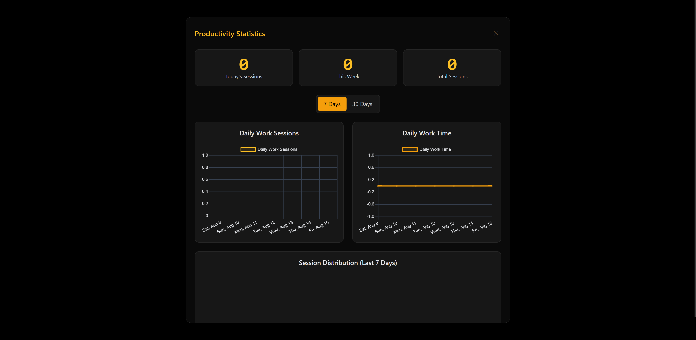
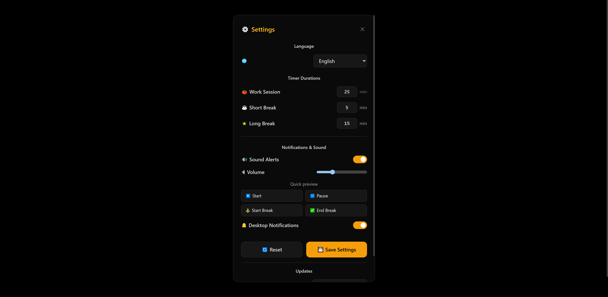

# 🍅 YuPomo – Boost productivity, one cycle at a time.

A beautiful, minimalist Pomodoro timer built with React, TypeScript, Vite, and Tauri. Available as a web app and native desktop app for Windows, macOS, and Linux.


—

- Website: https://yuricunha.com
- Demo: https://yupomo.yuricunha.com/
- Repo: https://github.com/isyuricunha/YuPomo
- X/Twitter: https://x.com/isyuricunha
- Email: me@yuricunha.com

## ✨ Features

- **🎯 Full Pomodoro Technique**: 25‑min work sessions, 5‑min short breaks, 15‑min long breaks
- **🌙 Dark/Light Mode**: True black + amber in dark mode, clean and minimal in light
- **⚙️ Customizable Settings**: Adjust timer durations, sound alerts, and notifications
- **📊 Productivity Statistics**: Track your progress with interactive charts
- **🔔 Smart Notifications**: Desktop and web notifications when sessions complete
- **🔊 Sound Alerts**: Audio feedback for session transitions
- **💾 Data Persistence**: Settings and statistics saved locally
- **📱 Responsive Design**: Works perfectly on desktop and mobile
 - **🌍 Localization (i18n)**: Full multi‑language support with runtime language switch
 - **📣 Update notification**: Detects latest GitHub release and shows an in‑app banner when a newer version is available

## 🚀 Quick Start

### Web Version
Use the hosted web app: https://yupomo.yuricunha.com/

### Desktop Installation

#### Windows
1. Download the `.exe` installer from [Releases](https://github.com/isyuricunha/YuPomo/releases)
2. Run the installer and follow the setup wizard
3. Launch YuPomo from your Start Menu

#### macOS
1. Download the `.dmg` file from [Releases](https://github.com/isyuricunha/YuPomo/releases)
2. Open the DMG and drag YuPomo to Applications
3. Launch from Applications folder

#### Linux
1. Download the `.AppImage` file from [Releases](https://github.com/isyuricunha/YuPomo/releases)
2. Make it executable: `chmod +x YuPomo.AppImage`
3. Run: `./YuPomo.AppImage`

## 🛠️ Development

### Prerequisites
- Node.js 18+
- Rust (for Tauri desktop builds)
- Git

### Setup
```bash
# Clone the repository
git clone https://github.com/isyuricunha/YuPomo.git
cd YuPomo

# Install dependencies
npm install

# Run web development server
npm run dev

# Run desktop development (Tauri)
npm run tauri dev
```

### Building

#### Web Build
```bash
# Build for web deployment
npm run build

# Preview production build
npm run preview
```

#### Desktop Build
```bash
# Windows
npm run build:win

# macOS (Intel)
npm run build:mac:intel

# macOS (Apple Silicon)
npm run build:mac:arm

# Linux (if toolchain configured)
npm run build:linux

# Bundles at: src-tauri/target/release/bundle/
```

### Release & versioning

YuPomo uses npm version lifecycle to keep versions in sync across web and Tauri:

```powershell
# Patch/minor/major — updates package.json, syncs Tauri files, creates tag and pushes
npm version patch -m "chore(release): v%s"
npm version minor -m "chore(release): v%s"
npm version major -m "chore(release): v%s"
```

What happens under the hood:

- `scripts/sync-version.mjs` updates `src-tauri/tauri.conf.json` and `src-tauri/Cargo.toml`.
- The `version` script stages those files into the version commit.
- `postversion` pushes the commit and tag to origin.

## 🔄 Desktop Auto‑Update (Tauri)

YuPomo supports desktop auto‑updates via Tauri Updater, with artifacts and `latest.json` published on GitHub Releases.

### What’s already implemented

- __Update check__: `src/hooks/useUpdateCheck.ts` calls GitHub’s API and shows a banner in the Home (`src/Timer.tsx`).
- __UI actions__ (`src/components/Settings.tsx`):
  - “Open latest release vX.Y.Z” link.
  - “Download and install” button (uses `@tauri-apps/api/updater` when available; falls back to opening the release in the browser).
  - “Auto update on startup (desktop)” toggle persisted to `localStorage` (`yupomo-auto-update`).
- __Auto‑install on startup__ (`src/Timer.tsx`): if an update is available and the preference is enabled, it tries to install via the updater.

### One‑time configuration

1. __Generate Tauri signing keys__
   - PowerShell in the project directory:
     ```powershell
     npx @tauri-apps/cli signer generate
     ```
   - Save the private key (.key) and its password; copy the public key string.

2. __Add the public key to the app__
   - In `src-tauri/tauri.conf.json` → `tauri.updater.pubkey`: paste your public key.

3. __Configure GitHub Secrets for CI__
   - Repo → Settings → Secrets and variables → Actions → New repository secret:
     - `TAURI_PRIVATE_KEY`: contents of your .key file
     - `TAURI_KEY_PASSWORD`: your key password
   - Ensure the workflow `.github/workflows/tauri-release.yml` passes these secrets to `tauri-action` via `env`.

4. __Verify endpoint and features__
   - `src-tauri/tauri.conf.json`:
     - `tauri.updater.active: true`
     - `tauri.updater.endpoints: ["https://github.com/isyuricunha/YuPomo/releases/latest/download/latest.json"]`
     - `tauri.updater.dialog: true`
     - `tauri.updater.windows.installMode: "passive"`
   - `src-tauri/Cargo.toml`: `tauri` has the `"updater"` feature enabled.

### How to publish an update

1. Commit your normal changes.
2. Run the version bump (syncs Tauri files, creates commit, tag and pushes):
   ```powershell
   npm version patch -m "chore(release): v%s"
   # or minor/major
   ```
3. GitHub Actions (workflow `tauri-release.yml`) will:
   - Build and sign the binaries.
   - Publish them to the Release and generate `latest.json`.

### How to test auto‑update

1. Install a previous version of the app.
2. Open the app with internet access. In Settings → Updates, enable “Auto update on startup (desktop)” if desired.
3. Publish a new release (steps above). On launch, the app should silently install the update; or click “Download and install”.

### Relevant files

- `src/hooks/useUpdateCheck.ts` — version check and daily throttling.
- `src/utils/version.ts` — semver comparison and fetching the latest release.
- `src/Timer.tsx` — banner with release link + auto‑install on startup.
- `src/components/Settings.tsx` — update UI, link, install button and auto‑update toggle.
- `src-tauri/Cargo.toml` — enables the `updater` feature.
- `src-tauri/tauri.conf.json` — updater configuration (endpoints, pubkey, dialog).
- `.github/workflows/tauri-release.yml` — builds, signs, and publishes artifacts and `latest.json`.

### Notes

- Tauri Updater signing verifies updates are legitimate; it is separate from OS code‑signing / notarization.
- On Windows/macOS, the OS may show SmartScreen/Gatekeeper prompts for new installs. That is independent of the updater.

### Release assets explained

- __Manual installers__ (for users to download and install):
  - Windows: `.exe`, `.msi`
  - macOS: `.dmg`
  - Linux: `.deb`, `.rpm`, raw `.AppImage`
  - These do not require `.sig` files.

- __Updater artifacts__ (used by in‑app auto‑update):
  - Windows: `YuPomo_*_en-US.msi.zip`, `YuPomo_*_setup.nsis.zip`
  - macOS: `YuPomo_*.app.tar.gz`
  - Linux: `yu-pomo_*_amd64.AppImage.tar.gz`
  - Each updater artifact has a companion `.sig` (minisign) file. The app uses your `pubkey` from `src-tauri/tauri.conf.json` to verify the artifact against the `.sig` before installing.
  - `latest.json` points the updater to these files.

## 📦 Tech Stack

- **Frontend**: React 18 + TypeScript + Vite
- **Styling**: TailwindCSS with custom themes (true black dark theme)
- **Charts**: Chart.js + react-chartjs-2
- **Desktop**: Tauri (Rust backend)
- **Storage**: localStorage (web) + Tauri filesystem (desktop)
- **Notifications**: Web Notification API + Tauri notifications
 - **i18n**: i18next + react-i18next
 - **Update check**: GitHub Releases API

## 🌍 Localization

YuPomo supports multiple languages and can switch instantly at runtime. Your preference is saved and restored across sessions.

Supported languages:

- English (en)
- Português (Brasil) (pt-BR)
- Español (es)
- Français (fr)
- Deutsch (de)
- Italiano (it)
- Русский (ru)
- 日本語 (ja)
- 简体中文 (zh-CN)
- 한국어 (ko)
- العربية (ar)
- עברית (he)
- فارسی (fa)
- हिंदी (hi)
- Türkçe (tr)

How to change the language:

- Open Settings → Language → choose your language → Save Settings.

## 🎨 Screenshots

### Light Mode


### Dark Mode with Statistics


### Settings Panel


## 🔧 Configuration

### Timer Settings
- Work session: 1-60 minutes (default: 25)
- Short break: 1-30 minutes (default: 5)  
- Long break: 1-60 minutes (default: 15)

### Notifications
- Desktop notifications for session completion
- Sound alerts
- Visual progress indicators

## 🔐 Privacy

Your privacy matters. YuPomo does not collect or send any personal data or telemetry.

- All preferences and statistics are stored locally:
  - Web: `localStorage`
  - Desktop: Tauri AppData (`pomodoro-settings.json`, `pomodoro-history.json`)
- Notifications and sounds are generated locally on your device.
- The optional update banner only calls the public GitHub Releases API to check the latest version.

## 📈 Statistics

Track your productivity with:
- Daily work session counts
- Weekly and monthly trends
- Total focus time calculations
- Session type distribution
- Productivity insights

## 🤝 Contributing

1. Fork the repository
2. Create a feature branch: `git checkout -b feature/amazing-feature`
3. Commit changes: `git commit -m 'Add amazing feature'`
4. Push to branch: `git push origin feature/amazing-feature`
5. Open a Pull Request

## 📄 License

This project is licensed under the LGPL-2.1 license — see the [LICENSE](LICENSE) file for details.

## 🙏 Acknowledgments

- Built with the Pomodoro Technique by Francesco Cirillo
- Icons and emojis for beautiful UI
- Chart.js for data visualization
- Tauri for cross-platform desktop apps

## 📞 Support

- 🐛 [Report Issues](https://github.com/isyuricunha/YuPomo/issues)
- 💡 [Request Features](https://github.com/isyuricunha/YuPomo/issues/new)
- 🌐 Demo: https://yupomo.yuricunha.com/
- 🐦 X/Twitter: https://x.com/isyuricunha
- ✉️ Email: me@yuricunha.com
- 🔗 Website: https://yuricunha.com

---

**Made with ❤️ for productivity enthusiasts**
